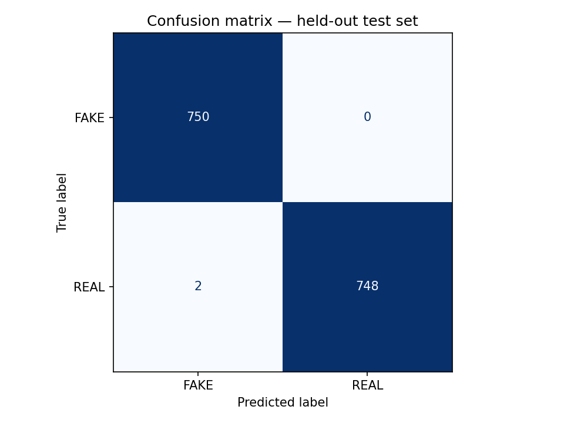
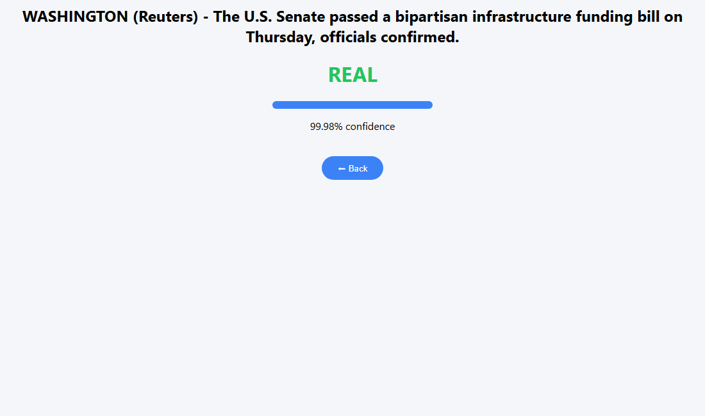
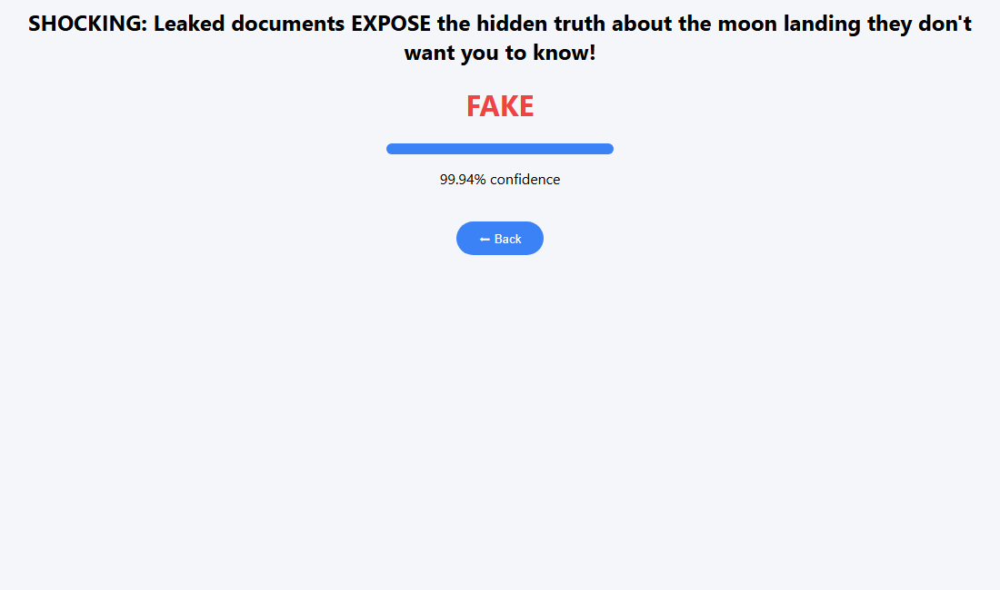
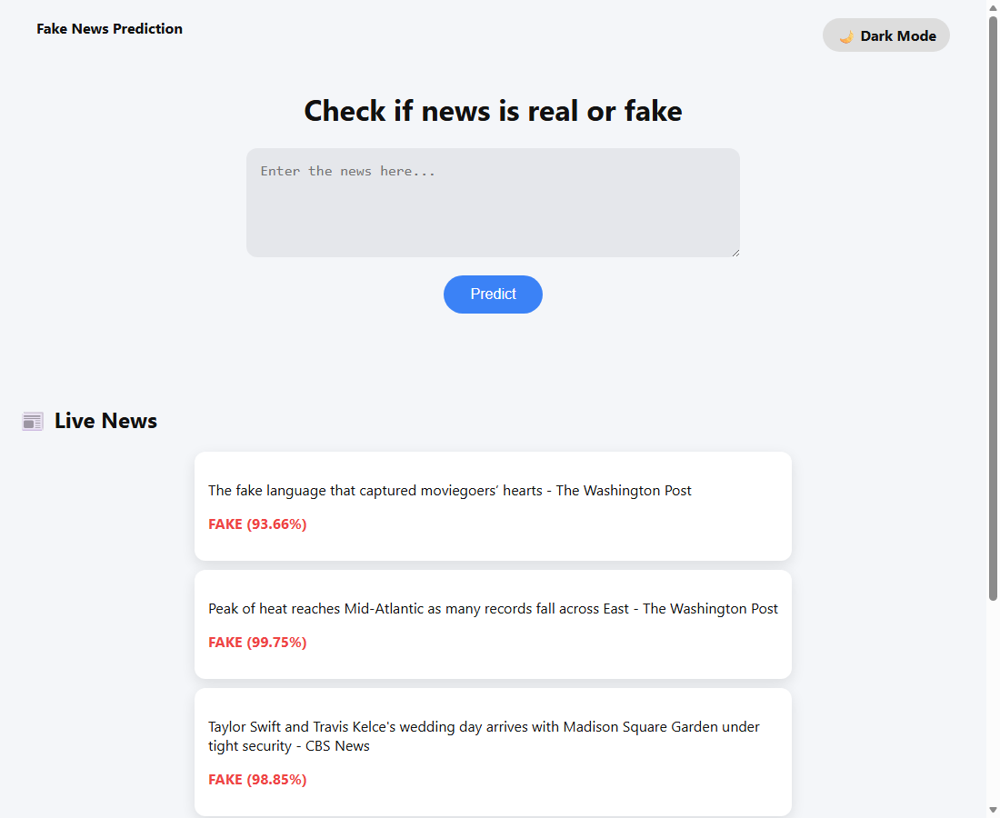

# Real-Time Fake News Detection (DistilBERT)

[](https://github.com/Pragatheswar-72/Real-Time-Fake-News-Detection-System/actions/workflows/ci.yml)

[](LICENSE)

Fine-tuned **DistilBERT** model that classifies news text as **REAL** or **FAKE**
with a confidence score, served over a **FastAPI** web app that also pulls live
headlines from **NewsAPI** and classifies them in real time.

## Model performance

Fine-tuned `distilbert-base-uncased` on the
[Kaggle Fake and Real News (ISOT) dataset](https://www.kaggle.com/datasets/clmentbisaillon/fake-and-real-news-dataset)
— 10,000 articles (5,000 per class), stratified 70/15/15 train/val/test split,
1 epoch, max sequence length 128. Metrics on the held-out test set
(1,500 articles never seen during training), with FAKE as the positive class:

| Metric    | Score  |
|-----------|--------|
| Accuracy  | 0.9987 |
| Precision | 0.9973 |
| Recall    | 1.0000 |
| F1        | 0.9987 |



**Limitation — read this before trusting the numbers.** Scores this high on the
ISOT dataset partly reflect dataset artifacts, not pure fake-news signal: the
"real" articles are Reuters wire copy with consistent formatting (many begin
with `CITY (Reuters) –`), while the "fake" articles come from very different
outlets, so the model can pick up stylistic shortcuts. Performance on
out-of-distribution or modern headlines will be lower. This project is a
demonstration of the fine-tuning + evaluation + serving pipeline, not a
production fact-checker.

## What it does

- Classifies any pasted news text as REAL/FAKE with a confidence score
- Fetches live US top headlines via NewsAPI every 60 seconds and classifies them
- Simple web frontend with dark mode and auto-refreshing live news feed

## Tech

Python · PyTorch · Hugging Face Transformers · DistilBERT · scikit-learn ·
FastAPI · NewsAPI · APScheduler

## How it works

1. `train_bert.py` fine-tunes `distilbert-base-uncased` on labeled real/fake
   news and writes the checkpoint to `bert_model/` plus a held-out
   `test_split.csv`.
2. `evaluate.py` scores the checkpoint on the held-out test set and saves
   `metrics.json` and a confusion matrix image.
3. The FastAPI app (`app.py`) lazily loads the fine-tuned model via
   `fakenews.py`.
4. Text — typed by the user or fetched from NewsAPI — is tokenized and
   classified; the app renders the label and confidence score.

## Screenshots

| Real headline | Fake headline |
|---------------|---------------|
|  |  |



The live feed above is the out-of-distribution limitation in action: today's
headlines (Washington Post, CBS) get labeled FAKE with high confidence because
they don't match the Reuters wire style the model learned to associate with
"real" news. The test-set numbers are honest, but so is this failure mode.

## Run locally

```bash
git clone https://github.com/Pragatheswar-72/Real-Time-Fake-News-Detection-System.git
cd Real-Time-Fake-News-Detection-System
python -m venv venv && venv\Scripts\activate   # Windows (use source venv/bin/activate on Linux/Mac)
pip install -r requirements.txt
```

1. Download `Fake.csv` and `True.csv` from the
   [Kaggle dataset](https://www.kaggle.com/datasets/clmentbisaillon/fake-and-real-news-dataset)
   into the repo root (or `pip install kagglehub` and use
   `kagglehub.dataset_download("clmentbisaillon/fake-and-real-news-dataset")`).
2. Fine-tune the model (about 30–60 min on CPU, minutes on GPU):
   ```bash
   python train_bert.py
   ```
3. Evaluate on the held-out test set:
   ```bash
   python evaluate.py
   ```
4. Copy `.env.example` to `.env` and add your free [NewsAPI](https://newsapi.org)
   key (optional — without it the app still works for manual predictions,
   just without the live news feed).
5. Start the app and open http://127.0.0.1:8000:
   ```bash
   uvicorn app:app --reload
   ```

## Tests

```bash
pytest
```

The suite mocks the model, so tests run without the checkpoint (that's also
what CI does on every push).

## Note on cost

NewsAPI has a free tier and the model runs locally — no paid APIs involved.
